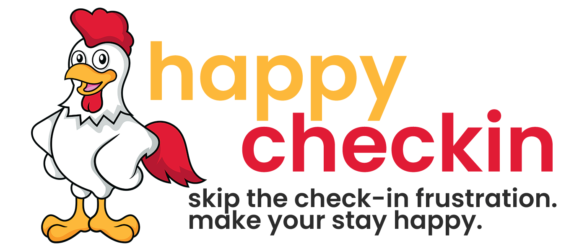

# Happy Checkin 
 


## Table of Contents
* [Description](#description)
* [Installation](#installation)
* [Usage](#usage)
* [Owners](#owners)
* [Credits](#credits)
* [License](#license)
* [Contributing](#contributing)
* [Tests](#tests)
* [Questions](#questions)


## Description
Happy Checkin is a service that takes the inconveniences out of the hotel check-in experience while offering add-ons that enhance the hotel arrival experience.  Flight delay? Special Request? Or just prefer to skip a check in process and head straight to your room? This is your service!
Happy Checkin lets you enjoy a care free process and allows you to arrive at your hotel of booking and simply grab your room key from the fron desk and get straight to your room! After creating an account and supplying your booking information, our APP lets you see your check in status in real time and notifies you when complete! 
**No more sad check-ins!**

### This app is for demonstration only, and is not a functioning service. If you fill out the form, a checker will not be assigned to your reservation.

## Installation
This application can be run via the deployed link below. If you'd like to run a copy of this app on your local machine, use the following steps:

1. Clone the repo - Navigate to the folder you'd like to store this app in locally in your command line and run this command:
```
git clone git@github.com:bgswilde/Happy-Checkin.git
```
2. Install Dependencies - Navigate to the root of the application in the command line and run this command to install all dependencies (which can be seen in the [Badges](#badges) section): 
```
npm install
```
3. Launch the application in dev mode where the application will reload upon save changes by running this command while still in the root folder: 
```
npm run develop
```
4. Please refer to the [Contribution Guide](#contribution) if you would like to contribute to open issues in this application.

## Usage
This app is used as a demonstration of a MERN application with a responsive front-end, e-commerce integration, and developed back-end. Although the business concept is cool, it is not meant to be used for customers actually looking for this service. Want to run with this idea as a legit business? Get in touch with us for conditions on using it as such! See our deployed link and screenshots below for more on this app in use:

### Deployed Link and Screenshots:
[happy-checkin.herokuapp.com](https://happy-checkin.herokuapp.com)


## Owners
This application was created in a team project setting, with the following Brians and Wills working in tandem:

[Brian W Github Profile](https://github.com/bgswilde)
---
[William H Github Profile](https://github.com/Will2tall)
---
[Brian K Github Profile](https://github.com/bpkaufman4)
---
[Will K Github Profile](https://github.com/wfknowles)
---

## Credits
This application uses great third-party open source libraries. One such library is the Syncfusion Date-Time-Picker, which was utilized in page 2 of the reservation form. This usage was approved under the [Syncfusion Community License](https://www.syncfusion.com/products/communitylicense). 

## License
[MIT](https://choosealicense.com/licenses/mit/)

## Contribution

If any contributions are to be made simply follow the [installation steps above](#installation), then proceed in this way: 

In your command line in the root folder of this application, navigate to the main branch and pull any possible changes newer than your local branch:
```
git pull origin main
```

Create a new feature branch with a name that lines up with the issue you're working on:
```
git checkout -b feature/<some feature branch name>
```

Once your changes are completed add, commit, and push your branch to the repo to be reviewed! 😄
```
git add <filename changes were made to>
git commit -m "<description on what was changed>"
git push origin feature/<branch name you are working in>
```
## Tests
Tests are to be added soon!

## Questions
If you have any questions, you can reach out to any of the owners of this application via the emails in their [github profiles](#owners). Brian Wilde, for example, can be reached at bgswilde@gmail.com. 

## Badges
                
